# Adding New Workflow Jobs to StashHog

This guide explains how to create workflow jobs that orchestrate multiple sub-jobs, with special attention to progress reporting and avoiding greenlet errors.

## Table of Contents

1. [What are Workflow Jobs?](#what-are-workflow-jobs)
2. [Architecture Overview](#architecture-overview)
3. [Implementation Guide](#implementation-guide)
4. [Progress Reporting](#progress-reporting)
5. [Metadata Requirements](#metadata-requirements)
6. [Avoiding Greenlet Errors](#avoiding-greenlet-errors)
7. [Frontend Integration](#frontend-integration)
8. [Example Implementation](#example-implementation)
9. [Testing Workflow Jobs](#testing-workflow-jobs)
10. [Troubleshooting](#troubleshooting)

## What are Workflow Jobs?

Workflow jobs are special job types that:
- Orchestrate multiple sub-jobs in a defined sequence
- Provide unified progress tracking across all steps
- Handle complex multi-stage operations
- Report detailed status for each step

The `process_new_scenes` job is an example that runs 7 distinct steps: download processing, metadata scanning, initial syncing, analysis, applying changes, metadata generation, and final syncing.

## Architecture Overview

### Key Components

1. **Main Workflow Handler**: Orchestrates the entire workflow
2. **Sub-job Creation**: Creates and monitors individual jobs
3. **Progress Aggregation**: Combines progress from all steps
4. **Metadata Tracking**: Maintains workflow state and sub-job information
5. **Frontend Display**: Special UI component for workflow visualization

### Workflow Structure

```python
workflow_job
├── Step 1: Sub-job A
├── Step 2: Sub-job B
├── Step 3: Sub-job C (may include multiple batches)
│   ├── Batch 1
│   ├── Batch 2
│   └── Batch N
└── Step N: Final sub-job
```

## Implementation Guide

### 1. Basic Workflow Template

```python
"""Your workflow job description."""

import asyncio
import logging
from typing import Any, Awaitable, Callable, Dict, List, Optional

from app.core.database import AsyncSessionLocal
from app.models.job import JobType
from app.services.job_service import JobService

logger = logging.getLogger(__name__)


async def your_workflow_job(
    job_id: str,
    progress_callback: Callable[[Optional[int], Optional[str]], Awaitable[None]],
    cancellation_token: Optional[Any] = None,
    **kwargs: Any,
) -> Dict[str, Any]:
    """Execute your workflow job.

    IMPORTANT: This is a workflow job that creates and monitors sub-jobs.
    Follow these guidelines:
    1. Each sub-job must use its own database session
    2. Update parent job metadata with current step info
    3. Use weighted progress calculation
    4. Handle cancellation across all sub-jobs
    5. Track all created subjobs for proper cancellation cleanup
    """
    logger.info(f"Starting workflow job {job_id}")

    # Initialize result tracking
    workflow_result: Dict[str, Any] = {
        "job_id": job_id,
        "status": "completed",
        "steps": {},
        "summary": {
            "total_items_processed": 0,
            "total_errors": 0,
            # Add workflow-specific summary fields
        },
    }

    # IMPORTANT: Track all created subjobs for cancellation handling
    created_subjobs: List[str] = []

    # Define step weights for progress calculation
    STEP_WEIGHTS = {
        1: (0, 20),     # Step 1: 0-20%
        2: (20, 50),    # Step 2: 20-50%
        3: (50, 90),    # Step 3: 50-90%
        4: (90, 100),   # Step 4: 90-100%
    }

    try:
        # Initial progress
        await progress_callback(0, "Starting workflow")

        # Get job service
        from app.core.dependencies import get_job_service
        job_service = get_job_service()

        # Step 1
        await progress_callback(5, "Step 1/4: First operation")
        step1_result = await _run_workflow_step(
            job_service,
            JobType.YOUR_SUB_JOB_TYPE,
            {"param1": "value1"},
            job_id,
            "First Operation",
            progress_callback,
            cancellation_token,
            workflow_result,
            "step1",
            {"current_step": 1, "total_steps": 4},
            created_subjobs,  # Pass the tracking list
        )

        if not step1_result or step1_result["status"] != "completed":
            workflow_result["status"] = "completed_with_errors"
            return workflow_result

        # Continue with more steps...

        # Final progress
        await progress_callback(100, "Workflow completed")
        # CRITICAL: Preserve final step metadata to avoid race condition
        # The job service may overwrite step metadata when marking job complete
        workflow_result["metadata_update"] = {
            "current_step": 4,  # Your final step number
            "total_steps": 4,
            "step_name": "Completed",
        }

        return workflow_result
    except asyncio.CancelledError:
        logger.info(f"Workflow {job_id} was cancelled")
        workflow_result["status"] = "cancelled"
        # CRITICAL: Wait for all subjobs to finish before allowing parent to be cancelled
        if created_subjobs:
            logger.info(f"Waiting for {len(created_subjobs)} subjobs to finish")
            await _wait_for_subjobs_to_finish(job_service, job_id, created_subjobs)

        raise
    except Exception as e:
        error_msg = f"Workflow failed: {str(e)}"
        logger.error(error_msg, exc_info=True)
        workflow_result["status"] = "failed"
        workflow_result["error"] = error_msg
        raise
```

### 2. Sub-job Creation and Monitoring

```python
async def _create_and_run_subjob(
    job_service: JobService,
    job_type: JobType,
    metadata: Dict[str, Any],
    parent_job_id: str,
    step_name: str,
    progress_callback: Callable[[Optional[int], Optional[str]], Awaitable[None]],
    cancellation_token: Optional[Any] = None,
    step_info: Optional[Dict[str, Any]] = None,
    created_subjobs: Optional[List[str]] = None,
) -> Optional[Dict[str, Any]]:
    """Create and run a sub-job, polling until completion.

    CRITICAL: Each database operation MUST use its own session to avoid greenlet errors.
    IMPORTANT: Pass created_subjobs list to track subjobs for cancellation handling.
    """
    # This log will include [job_type=..., job_id=..., parent_job_id=...] automatically
    logger.info(f"Starting {step_name} for parent job {parent_job_id}")

    # Check if already cancelled before creating sub-job
    if cancellation_token and cancellation_token.is_cancelled:
        logger.info(f"Skipping {step_name} - workflow already cancelled")
        return None

    # Create sub-job with its own session
    async with AsyncSessionLocal() as db:
        sub_job = await job_service.create_job(
            job_type=job_type,
            db=db,
            metadata={**metadata, "parent_job_id": parent_job_id},
        )
        await db.commit()
        sub_job_id = str(sub_job.id)

    # Track the subjob for cancellation handling
    if created_subjobs is not None:
        created_subjobs.append(sub_job_id)

    # Update parent job metadata with current sub-job info
    if step_info:
        async with AsyncSessionLocal() as db:
            parent_job = await job_service.get_job(parent_job_id, db)
            if parent_job:
                parent_metadata = parent_job.job_metadata or {}
                parent_metadata.update({
                    "current_step": step_info.get("current_step", 1),
                    "total_steps": step_info.get("total_steps", 1),
                    "step_name": step_name,
                    "active_sub_job": {
                        "id": sub_job_id,
                        "type": job_type.value,
                        "status": "running",
                        "progress": 0,
                    },
                })
                parent_job.job_metadata = parent_metadata
                await db.commit()

    # Poll for completion
    poll_interval = 2  # seconds
    while True:
        # Check cancellation
        if cancellation_token and cancellation_token.is_cancelled:
            logger.info(f"Parent job {parent_job_id} cancelled, stopping {step_name}")
            async with AsyncSessionLocal() as db:
                await job_service.cancel_job(sub_job_id, db)
                await db.commit()
            return None

        # Check sub-job status with new session
        async with AsyncSessionLocal() as db:
            sub_job_result = await job_service.get_job(sub_job_id, db)
            if not sub_job_result:
                logger.error(f"Sub-job {sub_job_id} not found")
                return None
            sub_job = sub_job_result

            # Update parent metadata with sub-job progress
            parent_job = await job_service.get_job(parent_job_id, db)
            if parent_job and parent_job.job_metadata:
                parent_metadata = parent_job.job_metadata
                if "active_sub_job" in parent_metadata:
                    parent_metadata["active_sub_job"]["status"] = sub_job.status.value
                    parent_metadata["active_sub_job"]["progress"] = sub_job.progress
                    parent_job.job_metadata = parent_metadata
                    await db.commit()

            if sub_job.is_finished():
                logger.info(f"Sub-job {sub_job_id} finished with status: {sub_job.status}")

                # Clear active sub-job from parent metadata
                if parent_job and parent_job.job_metadata and "active_sub_job" in parent_job.job_metadata:
                    parent_metadata = parent_job.job_metadata
                    parent_metadata["active_sub_job"] = None
                    parent_job.job_metadata = parent_metadata
                    await db.commit()

                return {
                    "job_id": sub_job_id,
                    "status": sub_job.status.value if hasattr(sub_job.status, "value") else sub_job.status,
                    "result": sub_job.result,
                    "error": sub_job.error,
                    "duration_seconds": sub_job.get_duration_seconds(),
                }

            # Update progress message (don't change percentage)
            raw_metadata = sub_job.job_metadata
            job_metadata: Dict[str, Any] = raw_metadata if isinstance(raw_metadata, dict) else {}
            await progress_callback(
                None,  # Don't change progress percentage
                f"{step_name}: {job_metadata.get('message', 'In progress...')}",
            )

        await asyncio.sleep(poll_interval)
```

### 3. Wait for Subjobs Function

```python
async def _wait_for_subjobs_to_finish(
    job_service: JobService,
    parent_job_id: str,
    created_subjobs: List[str],
    max_wait_seconds: int = 300,  # 5 minutes max wait
) -> None:
    """Wait for all subjobs to reach a terminal state.

    This ensures that when a workflow job is cancelled, it doesn't transition
    to CANCELLED status until all of its subjobs have finished cancelling.
    This prevents the parent job from appearing as cancelled while subjobs
    are still running or in the process of being cancelled.
    """
    if not created_subjobs:
        return

    logger.info(f"Waiting for {len(created_subjobs)} subjobs to finish for parent job {parent_job_id}")

    start_time = asyncio.get_event_loop().time()
    poll_interval = 1  # second

    while True:
        # Check if we've exceeded max wait time
        elapsed = asyncio.get_event_loop().time() - start_time
        if elapsed > max_wait_seconds:
            logger.warning(f"Timeout waiting for subjobs to finish after {elapsed:.1f}s")
            break

        # Check status of all subjobs
        all_finished = True
        async with AsyncSessionLocal() as db:
            for subjob_id in created_subjobs:
                subjob = await job_service.get_job(subjob_id, db)
                if subjob and not subjob.is_finished():
                    all_finished = False
                    break

        if all_finished:
            logger.info(f"All {len(created_subjobs)} subjobs have finished")
            break

        await asyncio.sleep(poll_interval)
```

### 4. Workflow Step Helper

```python
async def _run_workflow_step(
    job_service: JobService,
    job_type: JobType,
    metadata: Dict[str, Any],
    parent_job_id: str,
    step_name: str,
    progress_callback: Callable[[Optional[int], Optional[str]], Awaitable[None]],
    cancellation_token: Optional[Any],
    workflow_result: Dict[str, Any],
    result_key: str,
    step_info: Optional[Dict[str, Any]] = None,
    created_subjobs: Optional[List[str]] = None,
) -> Optional[Dict[str, Any]]:
    """Run a workflow step and update results."""
    # Check if already cancelled before creating sub-job
    if cancellation_token and cancellation_token.is_cancelled:
        logger.info(f"Skipping {step_name} - workflow already cancelled")
        return None

    result = await _create_and_run_subjob(
        job_service,
        job_type,
        metadata,
        parent_job_id,
        step_name,
        progress_callback,
        cancellation_token,
        step_info,
        created_subjobs,
    )

    workflow_result["steps"][result_key] = result

    if not result or result["status"] != "completed":
        workflow_result["status"] = "completed_with_errors"
        workflow_result["summary"]["total_errors"] += 1

    return result
```

## Progress Reporting

### Weighted Progress Calculation

Workflow jobs should use weighted progress to ensure smooth progress across all steps. The current implementation uses **manual progress reporting** at specific points:

```python
# Define step weights (for future smooth progress implementation)
STEP_WEIGHTS = {
    1: (0, 15),     # Step 1: 0-15%
    2: (15, 30),    # Step 2: 15-30%
    3: (30, 80),    # Step 3: 30-80% (larger step)
    4: (80, 95),    # Step 4: 80-95%
    5: (95, 100),   # Step 5: 95-100%
}

# Current implementation: Manual progress points (7 steps for process_new_scenes)
await progress_callback(5, "Step 1/7: Processing downloads")
await progress_callback(15, "Step 2/7: Scanning metadata")
await progress_callback(25, "Step 3/7: Running incremental sync")
await progress_callback(40, "Step 4/7: Analyzing scenes")
await progress_callback(75, "Step 5/7: Generating metadata")
await progress_callback(85, "Step 6/7: Final sync")
await progress_callback(100, "Workflow completed")
```

**Note**: The current implementation prevents progress bar resets by using fixed percentages. For smoother intra-step progress, see `/plans/smoother_workflow_step_progress.md`.

### Progress Callback Notes

1. **Type Signature**: `Callable[[Optional[int], Optional[str]], Awaitable[None]]`
   - First parameter: Progress percentage (0-100) or None to keep current
   - Second parameter: Optional status message

2. **Message Updates**: You can update just the message without changing progress:
   ```python
   await progress_callback(None, "Processing batch 5/10")
   ```

3. **Sub-job Progress**: Don't update parent progress directly from sub-job monitoring. The current implementation correctly passes `None` for progress when monitoring sub-jobs:
   ```python
   await progress_callback(
       None,  # Don't change progress
       f"{step_name}: {job_metadata.get('message', 'In progress...')}",
   )
   ```

4. **Avoid Setting 100% on Cancellation**: Only set progress to 100% when the workflow actually completes:
   ```python
   # Final progress - only set to 100% if we actually completed
   if workflow_result["status"] == "completed" or workflow_result["status"] == "completed_with_errors":
       await progress_callback(100, "Workflow completed")
   ```

## Managing Workflow Completion

### Avoiding the Final Step Race Condition

> **⚠️ CRITICAL ISSUE: This race condition is one of the most difficult bugs to diagnose in workflow systems**
>
> The final step race condition caused the `process_new_scenes` workflow to display "Step 6/7" instead of "Step 7/7" when complete. This issue took significant effort to diagnose and fix due to its intermittent nature and the complex interaction between async operations, database sessions, and timing.

When a workflow job completes, there's a critical race condition where the job service marks the job as complete and may overwrite the final step metadata with stale data. This can result in the UI showing "Step 6/7" instead of "Step 7/7" even though the workflow completed successfully.

#### The Problem (Detailed Technical Analysis)

This race condition is extremely difficult to diagnose because it involves multiple layers of abstraction and timing-dependent behavior:

##### Core Issue: Concurrent Database Operations

```mermaid
sequenceDiagram
    participant W as Workflow Job
    participant DB1 as DB Session 1
    participant DB2 as DB Session 2
    participant JS as Job Service
    participant JR as Job Repository
    participant UI as Frontend UI
    W->>DB1: Set step 7 metadata
    DB1->>DB1: Commit (but not yet visible)
    W->>JS: Return workflow result
    JS->>DB2: Read job to mark complete
    DB2->>JS: Returns job (stale: step 6)
    Note over DB2: Session isolation - doesn't see DB1's commit
    JS->>JR: Update job status to complete
    JR->>DB2: Write status + stale metadata
    DB2->>DB2: Commit (overwrites step 7)
    UI->>DB2: Fetch job status
    DB2->>UI: Shows "Step 6/7" ❌
```



##### Why SQLAlchemy Makes This Worse

1. **Session Isolation Levels**:
   ```python
   # Session 1 (workflow)
   async with AsyncSessionLocal() as db:
       job.metadata = {"current_step": 7}
       await db.commit()  # Committed but...
   # Session 2 (job service) - may not see Session 1's changes
   async with AsyncSessionLocal() as db:
       job = await db.get(Job, job_id)
       # job.metadata might still show step 6!
   ```

2. **Refresh Operations Don't Help**:
   ```python
   # Even explicit refresh might get stale data
   await db.refresh(job)  # Still reads from session's view
   ```

3. **Async Context Switching**:
   - Between setting step 7 and job completion, async operations yield control
   - Other operations can interleave, creating race windows
   - The timing is non-deterministic and load-dependent

##### Symptoms That Make Debugging Difficult

1. **Misleading Log Evidence**:
   ```
   2024-01-15 10:30:45 INFO - STEP 7 UPDATE: Setting job abc-123 to step 7
   2024-01-15 10:30:45 INFO - Successfully updated metadata: current_step=7
   2024-01-15 10:30:46 INFO - Workflow completed successfully
   2024-01-15 10:30:46 INFO - Marking job abc-123 as complete
   2024-01-15 10:30:46 DEBUG - Final job state: current_step=6  # ???
   ```

2. **Intermittent Nature**:
   - Works fine under low load
   - Fails under high concurrency
   - Timing-dependent (millisecond windows)
   - May work 9/10 times

3. **Database Shows Temporary Correctness**:
   ```sql
   -- Query at 10:30:45.500
   SELECT job_metadata FROM jobs WHERE id = 'abc-123';
   -- Result: {"current_step": 7}  ✓

   -- Query at 10:30:46.100
   SELECT job_metadata FROM jobs WHERE id = 'abc-123';
   -- Result: {"current_step": 6}  ✗
   ```

#### The Solution (Complete Implementation Across All Layers)

The solution requires coordinated changes across three layers to ensure the final step metadata is preserved:

##### Layer 1: Workflow Job (process_new_scenes_job.py)

```python
async def process_new_scenes_job(
    job_id: str,
    progress_callback: Callable[[Optional[int], Optional[str]], Awaitable[None]],
    cancellation_token: Optional[Any] = None,
    **kwargs: Any,
) -> Dict[str, Any]:
    # ... workflow implementation ...

    # Step 7: Set final step and complete
    await _update_parent_job_step(job_service, job_id, 7, "Completed")
    await progress_callback(100, "Step 7/7: Completed")

    # CRITICAL: Include metadata_update to survive the race condition
    # This is the key - we pass the final step data in the result
    workflow_result["metadata_update"] = {
        "current_step": 7,
        "total_steps": 7,
        "step_name": "Completed",
    }

    logger.info(f"Workflow {job_id} completed with metadata_update: {workflow_result['metadata_update']}")
    return workflow_result
```

##### Layer 2: Job Service (job_service.py)

```python
async def _handle_job_completion(self, job_id: str, result: Dict[str, Any]) -> None:
    """Handle job completion with race condition protection."""

    # Extract metadata_update if present (critical for workflows)
    metadata_update = None
    if isinstance(result, dict) and "metadata_update" in result:
        metadata_update = result.pop("metadata_update")
        logger.info(f"Extracted metadata_update for job {job_id}: {metadata_update}")

    # Update job status with metadata preservation
    async with AsyncSessionLocal() as db:
        await self._update_job_status_with_session(
            job_id=job_id,
            status=JobStatus.COMPLETED,
            result=result,
            message="Job completed successfully",
            db=db,
            metadata_update=metadata_update,  # Pass through to repository
        )
        await db.commit()
```

##### Layer 3: Job Repository (job_repository.py)

```python
async def update_job_status(
    self,
    job_id: str,
    status: JobStatus,
    db: AsyncSession,
    message: Optional[str] = None,
    error: Optional[str] = None,
    result: Optional[Dict[str, Any]] = None,
    metadata_update: Optional[Dict[str, Any]] = None,  # New parameter
) -> Optional[Job]:
    """Update job status with race condition protection."""

    job = await self.get_job(job_id, db)
    if not job:
        return None

    # Standard updates
    job.status = status
    if message:
        job.message = message
    if error:
        job.error = error
    if result is not None:
        job.result = result

    # CRITICAL: Apply metadata_update AFTER refresh to override stale data
    if metadata_update:
        logger.info(f"Applying metadata_update to job {job_id}: {metadata_update}")
        current_metadata = job.job_metadata or {}
        current_metadata.update(metadata_update)
        job.job_metadata = current_metadata
        logger.debug(f"Job {job_id} metadata after update: {job.job_metadata}")

    # Mark completion time
    if status in [JobStatus.COMPLETED, JobStatus.FAILED, JobStatus.CANCELLED]:
        job.completed_at = datetime.utcnow()

    await db.flush()
    return job
```

##### Why This Solution Works

1. **Atomic Update**: The metadata_update is applied in the same transaction that marks the job complete
2. **Override Stale Data**: Even if the job service reads stale metadata, the metadata_update overwrites it
3. **No Additional Round Trips**: The solution doesn't require extra database queries
4. **Backward Compatible**: Workflows without metadata_update continue to work (with potential race condition)

#### Troubleshooting Guide

##### How to Identify the Race Condition in Logs

Look for these specific patterns that indicate the race condition:

```bash
# Pattern 1: Step regression (most obvious symptom)
grep -A2 -B2 "current_step" log.txt | grep -E "job_id|current_step"
2024-01-15 10:30:45 [job_id=abc-123] current_step: 7  # Set correctly
2024-01-15 10:30:46 [job_id=abc-123] current_step: 6  # Regressed!

# Pattern 2: Completion with wrong step
grep -E "(Workflow completed|current_step)" log.txt
10:30:45 INFO - Workflow completed successfully
10:30:46 DEBUG - Final state: {"current_step": 6, "total_steps": 7}  # Wrong!

# Pattern 3: Metadata update not applied
grep "metadata_update" log.txt
10:30:45 INFO - Workflow returning with metadata_update: {"current_step": 7}
# Missing: "Applied metadata_update" log entry
```

##### Debug Strategy for Race Conditions

1. **Enable Debug Logging**:
   ```python
   # In your workflow
   logger.debug(f"Before setting step 7: {job.job_metadata}")
   await _update_parent_job_step(job_service, job_id, 7, "Completed")
   logger.debug(f"After setting step 7: {job.job_metadata}")
   ```

2. **Add Timing Information**:
   ```python
   import time

   # Track timing of operations
   t1 = time.time()
   await _update_parent_job_step(job_service, job_id, 7, "Completed")
   t2 = time.time()
   logger.info(f"Step 7 update took {t2-t1:.3f}s")

   # If this is > 0.1s, you have a race window
   ```

3. **Database Query Verification**:
   ```sql
   -- Run this query repeatedly during workflow completion
   SELECT id, status, job_metadata->>'current_step' as step,
          updated_at, completed_at
   FROM jobs
   WHERE id = 'your-job-id'
   ORDER BY updated_at DESC;
   ```

4. **Add Assertions in Development**:
   ```python
   if os.getenv("DEBUG_RACE_CONDITIONS"):
       # Verify step was preserved
       async with AsyncSessionLocal() as db:
           job = await job_service.get_job(job_id, db)
           assert job.job_metadata.get("current_step") == 7, \
               f"Race condition detected! Step is {job.job_metadata.get('current_step')}"
   ```

##### Common Mistakes That Cause the Race Condition

1. **❌ Setting Final Step After Return**:
   ```python
   # WRONG - This happens after the result is returned
   workflow_result = {...}
   asyncio.create_task(update_final_step())  # Too late!
   return workflow_result
   ```

2. **❌ Forgetting metadata_update**:
   ```python
   # WRONG - No protection against race condition
   await _update_parent_job_step(job_service, job_id, 7, "Completed")
   return workflow_result  # Missing metadata_update!
   ```

3. **❌ Using Fire-and-Forget Updates**:
   ```python
   # WRONG - Not waiting for completion
   asyncio.create_task(_update_parent_job_step(...))
   # Continues without waiting
   ```

4. **❌ Multiple Session Updates**:
   ```python
   # WRONG - Creates multiple race windows
   async with AsyncSessionLocal() as db:
       # Update 1
   async with AsyncSessionLocal() as db:
       # Update 2 - might not see Update 1
   ```

#### Best Practices for Avoiding Race Conditions

##### Essential Patterns

1. **Always Use the metadata_update Pattern**:
   ```python
   # CORRECT - Race-condition proof
   async def your_workflow_job(...) -> Dict[str, Any]:
       try:
           # ... workflow steps ...

           # Final step - BOTH update and metadata_update
           await _update_parent_job_step(job_service, job_id, 7, "Completed")

           workflow_result["metadata_update"] = {
               "current_step": 7,
               "total_steps": 7,
               "step_name": "Completed",
           }
           return workflow_result
       except Exception as e:
           # Don't set completed step on failure
           workflow_result["status"] = "failed"
           raise
   ```

2. **Defensive Step Updates**:
   ```python
   async def _update_parent_job_step(
       job_service: JobService,
       job_id: str,
       step: int,
       step_name: str,
       retry_on_conflict: bool = True,
   ) -> None:
       """Update parent job step with retry logic."""
       max_retries = 3 if retry_on_conflict else 1

       for attempt in range(max_retries):
           try:
               async with AsyncSessionLocal() as db:
                   job = await job_service.get_job(job_id, db)
                   if job:
                       metadata = job.job_metadata or {}
                       old_step = metadata.get("current_step", 0)

                       # Only update if moving forward
                       if step > old_step:
                           metadata.update({
                               "current_step": step,
                               "step_name": step_name,
                           })
                           job.job_metadata = metadata
                           await db.commit()
                           logger.info(f"Updated job {job_id} from step {old_step} to {step}")
                           return
                       else:
                           logger.warning(f"Skipping backwards step update: {old_step} -> {step}")
                           return
           except Exception as e:
               if attempt < max_retries - 1:
                   await asyncio.sleep(0.1 * (attempt + 1))  # Exponential backoff
               else:
                   logger.error(f"Failed to update step after {max_retries} attempts: {e}")
                   raise
   ```

3. **Transaction Boundaries**:
   ```python
   # CORRECT - Single transaction for related updates
   async with AsyncSessionLocal() as db:
       job = await job_service.get_job(job_id, db)
       job.job_metadata = {"current_step": 7}
       job.message = "Workflow completed"
       await db.commit()  # Atomic update

   # WRONG - Multiple transactions create race windows
   async with AsyncSessionLocal() as db:
       job = await job_service.get_job(job_id, db)
       job.job_metadata = {"current_step": 7}
       await db.commit()

   async with AsyncSessionLocal() as db:  # Different session!
       job = await job_service.get_job(job_id, db)
       job.message = "Workflow completed"
       await db.commit()
   ```

4. **Testing for Race Conditions**:
   ```python
   @pytest.mark.asyncio
   async def test_workflow_final_step_race_condition():
       """Test that final step survives completion race condition."""

       # Create workflow job
       job_id = await create_test_workflow_job()

       # Simulate race condition by running completion in parallel
       async def complete_workflow():
           result = await workflow_job(job_id, AsyncMock())
           return result

       async def mark_job_complete():
           await asyncio.sleep(0.01)  # Small delay to create race
           await job_service.mark_complete(job_id)

       # Run both operations concurrently
       results = await asyncio.gather(
           complete_workflow(),
           mark_job_complete(),
           return_exceptions=True,
       )

       # Verify final step is preserved
       job = await get_job(job_id)
       assert job.job_metadata["current_step"] == 7, \
           f"Race condition! Step is {job.job_metadata.get('current_step')}"
   ```

5. **Monitoring and Alerts**:
   ```python
   # Add monitoring to detect race conditions in production
   async def check_workflow_consistency():
       """Check for workflows with inconsistent step status."""

       query = """
           SELECT id, status, job_metadata
           FROM jobs
           WHERE type = 'process_new_scenes'
           AND status = 'completed'
           AND (job_metadata->>'current_step')::int <
               (job_metadata->>'total_steps')::int
       """

       inconsistent_jobs = await db.execute(query)
       if inconsistent_jobs:
           logger.error(f"Found {len(inconsistent_jobs)} jobs with race condition")
           # Send alert to monitoring system
   ```

#### Lessons Learned: Why This Bug Was So Difficult

> **📚 LESSONS LEARNED FROM THE FINAL STEP RACE CONDITION**
>
> This race condition in the `process_new_scenes` workflow taught us several critical lessons about debugging complex async systems:
>
> **1. Traditional Debugging Failed**
> - Adding log statements showed step 7 being set correctly
> - Database queries confirmed step 7 was saved
> - But the final state still showed step 6
> - The issue was in the gap between operations, not the operations themselves
>
> **2. SQLAlchemy Session Management is Complex**
> - Different sessions have different views of the database
> - `refresh()` doesn't always get the latest data
> - Session isolation levels matter more than expected
> - Async context makes session behavior harder to predict
>
> **3. Race Conditions are Timing-Dependent**
> - The bug only appeared under specific timing conditions
> - Load testing didn't always reproduce it
> - Single-stepping with debugger made it disappear
> - Required understanding the entire async execution flow
>
> **4. The Solution Required Multi-Layer Coordination**
> - Fixing just the workflow layer wasn't enough
> - Required changes to job service and repository
> - The `metadata_update` pattern provides a general solution
> - This pattern can be applied to other race conditions
>
> **5. Defensive Programming is Essential**
> - Always include metadata in the result for preservation
> - Use atomic operations where possible
> - Add retry logic for critical updates
> - Monitor for inconsistencies in production
>
> **6. Documentation is Critical**
> - Future developers need to understand the why, not just the what
> - Include diagrams for complex timing issues
> - Provide concrete examples of the problem and solution
> - Document the debugging process for similar issues
>
> **Key Takeaway**: When dealing with async workflows and database operations, always assume race conditions are possible. Design your system to be resilient to them from the start, rather than trying to fix them after they occur.

## Metadata Requirements

### Parent Job Metadata Structure

```python
{
    "current_step": 2,              # Current step number (1-based)
    "total_steps": 7,               # Total number of steps (7 for process_new_scenes)
    "step_name": "Metadata Scan",   # Human-readable step name
    "active_sub_job": {             # Currently running sub-job
        "id": "abc-123",
        "type": "stash_scan",
        "status": "running",
        "progress": 45
    },
    "message": "Scanning 1500 files..."  # Optional status message
}
```

### Workflow Result Structure

```python
{
    "job_id": "workflow-123",
    "status": "completed",  # or "failed", "cancelled", "completed_with_errors"
    "steps": {
        "step1": {
            "job_id": "sub-job-1",
            "status": "completed",
            "result": {...},
            "duration_seconds": 120
        },
        "step2": {
            "job_id": "sub-job-2",
            "status": "completed",
            "result": {...},
            "duration_seconds": 300
        }
    },
    "summary": {
        "total_items_processed": 150,
        "total_errors": 0,
        # Add workflow-specific summary fields
    }
}
```

## Avoiding Greenlet Errors

### Critical Rules for Workflow Jobs

1. **Each Database Operation Needs Its Own Session**
   ```python
   # ✅ CORRECT: New session for each operation
   async with AsyncSessionLocal() as db:
       parent_job = await job_service.get_job(parent_job_id, db)
       # Update and commit
       await db.commit()

   # ❌ WRONG: Reusing sessions
   db = some_external_session  # Never do this
   ```

2. **Don't Pass Sessions Between Functions**
   ```python
   # ✅ CORRECT: Each function creates its own session
   async def update_parent_metadata(job_id: str, metadata: dict):
       async with AsyncSessionLocal() as db:
           job = await job_service.get_job(job_id, db)
           job.job_metadata = metadata
           await db.commit()

   # ❌ WRONG: Passing session as parameter
   async def update_parent_metadata(db: AsyncSession, job_id: str, metadata: dict):
       # This can cause greenlet errors
   ```

3. **Progress Callbacks Are Session-Independent**
   ```python
   # ✅ CORRECT: Use the provided callback
   await progress_callback(50, "Processing...")

   # ❌ WRONG: Manual job updates
   async with AsyncSessionLocal() as db:
       job = await db.get(Job, job_id)
       job.progress = 50  # Don't do this
   ```

4. **Handle Service Returns Properly**
   ```python
   # When job_service returns objects created in different sessions
   job = await job_service.create_job(...)

   # ✅ CORRECT: Refresh if needed
   await db.refresh(job)

   # ❌ WRONG: Direct attribute access might fail
   job_id = job.id  # May cause greenlet error
   ```

5. **Complete Operations Before Session Closes**
   ```python
   # ✅ CORRECT: Access all needed data while session is active
   async with AsyncSessionLocal() as db:
       job = await job_service.get_job(job_id, db)
       metadata = job.job_metadata  # Access while session is open
       await db.commit()

   # Now safe to use metadata outside session
   process_metadata(metadata)
   ```

6. **Clean Up Resources on Cancellation**
   ```python
   # If your workflow creates pending resources (like analysis plans),
   # clean them up in the cancellation handler:
   except asyncio.CancelledError:
       logger.info(f"Workflow {job_id} was cancelled")
       workflow_result["status"] = "cancelled"

       # CRITICAL: Wait for subjobs to finish cancelling
       if created_subjobs:
           await _wait_for_subjobs_to_finish(job_service, job_id, created_subjobs)

       # Clean up any other pending resources
       await _cleanup_pending_plans(job_id)
       raise
   ```

7. **Proper Cancellation Handling for Workflows**
   ```python
   # ✅ CORRECT: Track subjobs and wait for them to finish
   created_subjobs: List[str] = []  # Track at workflow level

   # Pass to all subjob creation functions
   await _create_and_run_subjob(..., created_subjobs=created_subjobs)

   # In cancellation handler, wait for subjobs
   except asyncio.CancelledError:
       if created_subjobs:
           await _wait_for_subjobs_to_finish(job_service, job_id, created_subjobs)
       raise

   # ❌ WRONG: Let parent transition to CANCELLED immediately
   except asyncio.CancelledError:
       # This causes parent to show as cancelled while subjobs are still running
       raise
   ```

8. **Use Eager Loading for Relationships**
   ```python
   # When fetching entities with relationships, use eager loading to avoid
   # lazy loading issues after session closes:
   async with AsyncSessionLocal() as db:
       scenes = await db.execute(
           select(Scene).options(
               selectinload(Scene.performers),
               selectinload(Scene.studio),
               selectinload(Scene.tags)
           )
       )
       scenes_list = scenes.scalars().all()

       # Access relationships while session is active
       for scene in scenes_list:
           performer_count = len(scene.performers)  # Safe
   ```

9. **Never Use Dynamic Relationships in Async Contexts**
   ```python
   # ❌ WRONG: Dynamic relationship in async function
   async def process_plan_changes(plan_id: int):
       async with AsyncSessionLocal() as db:
           plan = await db.get(AnalysisPlan, plan_id)
           # This will cause greenlet error!
           changes = plan.changes.filter_by(accepted=False).all()

   # ✅ CORRECT: Use explicit query
   async def process_plan_changes(plan_id: int):
       async with AsyncSessionLocal() as db:
           changes_query = select(PlanChange).where(
               PlanChange.plan_id == plan_id,
               PlanChange.accepted.is_(False)
           )
           result = await db.execute(changes_query)
           changes = result.scalars().all()
   ```

### Common Greenlet Error Scenarios in Workflows

1. **Cross-Session Sub-job Updates**
   - Problem: Updating parent job from sub-job context
   - Solution: Each update uses its own session

2. **Lazy Loading After Polling**
   - Problem: Accessing sub-job attributes after polling session closes
   - Solution: Extract needed data while session is active

3. **Shared State Between Steps**
   - Problem: Passing SQLAlchemy objects between workflow steps
   - Solution: Pass primitive values (IDs, dicts) instead

4. **Dynamic Relationships in Workflow Steps**
   - Problem: Using SQLAlchemy dynamic relationships in async workflow functions
   - Solution: Use explicit queries with `select()` instead of dynamic relationship methods
   - Example: The `_approve_plan_changes()` function in `process_new_scenes_job.py` was fixed by replacing `plan.changes.filter_by()` with an explicit query

## Frontend Integration

### 1. Update Job Type Definitions

Add your workflow job type to `frontend/src/utils/jobUtils.ts`:

```typescript
export type JobType =
  // ... existing types ...
  | 'your_workflow_job';

export const JOB_TYPE_LABELS: Record<string, string> = {
  // ... existing labels ...
  your_workflow_job: 'Your Workflow Process',
};

export const JOB_TYPE_COLORS: Record<string, string> = {
  // ... existing colors ...
  your_workflow_job: 'purple',  // Workflows often use purple
};

// Special handling for workflow progress display
export const formatJobProgress = (
  type: string,
  processed: number | undefined,
  total: number | undefined,
  progress: number
): string => {
  if (type === 'your_workflow_job') {
    return ' steps';  // Shows "Step 3/7 steps" (7 for process_new_scenes)
  }
  // ... rest of function
};
```

### 2. WorkflowJobCard Integration

The `WorkflowJobCard` component automatically displays workflow jobs with:
- Step-by-step progress visualization
- Current step indicator
- Sub-job details
- Overall progress bar

To enable it for your workflow:

```typescript
// In JobCard.tsx
if (job.type === 'your_workflow_job' && !compact) {
  return (
    <WorkflowJobCard
      job={job}
      onCancel={onCancel}
      onRetry={onRetry}
      onDelete={onDelete}
    />
  );
}
```

### 3. Update TypeScript Type Definitions

Ensure the Job metadata type in `frontend/src/types/models.ts` supports workflow metadata:

```typescript
metadata?: Record<string, string | number | boolean | null | Record<string, any>> & {
  // ... existing fields ...
  // Workflow job metadata
  current_step?: number;
  total_steps?: number;
  step_name?: string;
  active_sub_job?: {
    id: string;
    type: string;
    status: string;
    progress: number;
  };
  message?: string;
};
```

### 4. Customize Workflow Steps Display (Optional)

The default `WorkflowJobCard` uses a generic 6-step workflow. For custom steps, modify the component:

```typescript
// Currently hardcoded in WorkflowJobCard.tsx (updated for 7 steps):
const WORKFLOW_STEPS = [
  { title: 'Process Downloads', description: 'Download and sync new content' },
  { title: 'Scan Metadata', description: 'Update Stash library metadata' },
  { title: 'Incremental Sync', description: 'Import new scenes' },
  { title: 'Analyze Scenes', description: 'Process unanalyzed scenes' },
  { title: 'Generate Metadata', description: 'Create previews and sprites' },
  { title: 'Final Sync', description: 'Sync any pending updates' },
  { title: 'Complete', description: 'Workflow finished' },
];
```

## Example Implementation

### Complete Workflow Example: Data Import Workflow

```python
"""Data import workflow that processes files through multiple stages."""

import asyncio
import logging
from typing import Any, Awaitable, Callable, Dict, List, Optional

from app.core.database import AsyncSessionLocal
from app.models.job import JobType
from app.services.job_service import JobService

logger = logging.getLogger(__name__)


async def data_import_workflow(
    job_id: str,
    progress_callback: Callable[[Optional[int], Optional[str]], Awaitable[None]],
    cancellation_token: Optional[Any] = None,
    **kwargs: Any,
) -> Dict[str, Any]:
    """Import data through validation, processing, and indexing stages."""
    logger.info(f"Starting data import workflow {job_id}")

    # Extract parameters
    import_path = kwargs.get("import_path", "")
    validate_only = kwargs.get("validate_only", False)

    # Initialize result
    workflow_result: Dict[str, Any] = {
        "job_id": job_id,
        "status": "completed",
        "steps": {},
        "summary": {
            "total_files": 0,
            "valid_files": 0,
            "processed_files": 0,
            "indexed_files": 0,
            "total_errors": 0,
        },
    }

    # Track created subjobs for cancellation handling
    created_subjobs: List[str] = []

    # Step weights
    STEP_WEIGHTS = {
        1: (0, 20),     # Validation: 0-20%
        2: (20, 60),    # Processing: 20-60%
        3: (60, 90),    # Indexing: 60-90%
        4: (90, 100),   # Cleanup: 90-100%
    }

    try:
        from app.core.dependencies import get_job_service
        job_service = get_job_service()

        # Step 1: Validate files
        await progress_callback(5, "Step 1/4: Validating import files")

        validation_result = await _run_workflow_step(
            job_service,
            JobType.VALIDATE_IMPORT,
            {"path": import_path},
            job_id,
            "File Validation",
            progress_callback,
            cancellation_token,
            workflow_result,
            "validation",
            {"current_step": 1, "total_steps": 4},
            created_subjobs,
        )

        if not validation_result:
            return workflow_result

        valid_files = validation_result.get("result", {}).get("valid_files", 0)
        workflow_result["summary"]["total_files"] = validation_result.get("result", {}).get("total_files", 0)
        workflow_result["summary"]["valid_files"] = valid_files

        if valid_files == 0:
            await progress_callback(100, "No valid files to import")
            return workflow_result

        if validate_only:
            await progress_callback(100, f"Validation complete: {valid_files} valid files")
            return workflow_result

        # Step 2: Process files
        await progress_callback(25, f"Step 2/4: Processing {valid_files} files")

        process_result = await _run_workflow_step(
            job_service,
            JobType.PROCESS_IMPORT,
            {"file_list": validation_result.get("result", {}).get("file_list", [])},
            job_id,
            "File Processing",
            progress_callback,
            cancellation_token,
            workflow_result,
            "processing",
            {"current_step": 2, "total_steps": 4},
            created_subjobs,
        )

        if process_result:
            workflow_result["summary"]["processed_files"] = process_result.get("result", {}).get("processed_files", 0)

        # Step 3: Index processed data
        await progress_callback(65, "Step 3/4: Indexing imported data")

        index_result = await _run_workflow_step(
            job_service,
            JobType.INDEX_DATA,
            {"process_job_id": process_result.get("job_id") if process_result else None},
            job_id,
            "Data Indexing",
            progress_callback,
            cancellation_token,
            workflow_result,
            "indexing",
            {"current_step": 3, "total_steps": 4},
            created_subjobs,
        )

        if index_result:
            workflow_result["summary"]["indexed_files"] = index_result.get("result", {}).get("indexed_count", 0)

        # Step 4: Cleanup
        await progress_callback(92, "Step 4/4: Cleaning up temporary files")

        await _run_workflow_step(
            job_service,
            JobType.CLEANUP_TEMP,
            {"import_path": import_path},
            job_id,
            "Cleanup",
            progress_callback,
            cancellation_token,
            workflow_result,
            "cleanup",
            {"current_step": 4, "total_steps": 4},
            created_subjobs,
        )

        # Final status
        await progress_callback(100, "Import workflow completed")

        logger.info(
            f"Data import workflow completed: "
            f"{workflow_result['summary']['processed_files']}/{workflow_result['summary']['total_files']} files processed"
        )

        return workflow_result

    except asyncio.CancelledError:
        logger.info(f"Workflow {job_id} was cancelled")
        workflow_result["status"] = "cancelled"
        # Wait for all subjobs to finish cancelling
        if created_subjobs:
            await _wait_for_subjobs_to_finish(job_service, job_id, created_subjobs)

        raise
    except Exception as e:
        error_msg = f"Import workflow failed: {str(e)}"
        logger.error(error_msg, exc_info=True)
        workflow_result["status"] = "failed"
        workflow_result["error"] = error_msg
        raise


def register_data_import_workflow(job_service: JobService) -> None:
    """Register the data import workflow handler."""
    job_service.register_handler(JobType.DATA_IMPORT_WORKFLOW, data_import_workflow)
    logger.info("Registered data import workflow handler")
```

## Testing Workflow Jobs

### Unit Tests

```python
import pytest
from unittest.mock import AsyncMock, MagicMock

async def test_workflow_creates_subjobs():
    """Test that workflow creates expected sub-jobs."""
    # Mock job service
    job_service = MagicMock()
    job_service.create_job = AsyncMock(return_value=MagicMock(
        id="sub-job-1",
        status=MagicMock(value="completed"),
        progress=100,
        job_metadata={},
        is_finished=MagicMock(return_value=True),
        result={"processed": 10}
    ))

    # Mock progress callback
    progress_callback = AsyncMock()

    # Run workflow
    result = await your_workflow_job(
        job_id="test-workflow",
        progress_callback=progress_callback,
        param1="value1"
    )

    # Verify sub-jobs were created
    assert job_service.create_job.call_count >= 3  # At least 3 steps

    # Verify progress was reported
    progress_callback.assert_any_call(0, "Starting workflow")
    progress_callback.assert_any_call(100, "Workflow completed")

    # Verify result structure
    assert result["status"] == "completed"
    assert "steps" in result
    assert "summary" in result
```

### Integration Tests

```python
async def test_workflow_handles_subjob_failure():
    """Test workflow behavior when a sub-job fails."""
    # Create a workflow that will have a failing sub-job
    result = await create_and_run_test_workflow(
        force_step2_failure=True
    )

    assert result["status"] == "completed_with_errors"
    assert result["summary"]["total_errors"] > 0
    assert result["steps"]["step2"]["status"] == "failed"
```

### Testing Greenlet Safety

```python
async def test_workflow_session_isolation():
    """Verify each operation uses its own session."""
    # This test would monitor session creation/closure
    # and verify no session is reused across operations
    pass
```

## Troubleshooting

### Common Issues

1. **Progress Bar Resets**
   - Cause: Not using weighted progress calculation
   - Solution: Implement proper step weights

2. **Sub-job Status Not Visible**
   - Cause: Parent metadata not updated
   - Solution: Update `active_sub_job` in parent metadata

3. **Greenlet Errors in Polling**
   - Cause: Reusing sessions or accessing lazy attributes
   - Solution: Create new session for each poll iteration

4. **Workflow Continues After Sub-job Failure**
   - Cause: Not checking sub-job result status
   - Solution: Check `result["status"] != "completed"`

5. **Parent Job Shows Cancelled While Subjobs Still Running**
   - Cause: Not waiting for subjobs to finish cancelling
   - Solution: Track subjobs and use `_wait_for_subjobs_to_finish()` in cancellation handler

6. **Final Step Not Displaying (Race Condition)** ⚠️ **CRITICAL ISSUE**
   - **Issue**: Workflow completes but shows an earlier step (e.g., "Step 6/7" instead of "Step 7/7")
   - **Cause**: Race condition where job completion overwrites the final step metadata with stale data
   - **Why This is So Difficult to Debug**:
     - Logs show correct behavior but UI shows wrong state
     - Issue is intermittent and timing-dependent
     - Traditional debugging approaches don't reveal the problem
     - Requires understanding of SQLAlchemy session isolation
   - **Detailed Technical Explanation**:
     - The workflow sets step 7 in one database session
     - The job service reads the job to mark it complete in another session
     - Due to session isolation, the job service may read stale metadata (step 6)
     - When updating the job status, it writes back the stale metadata
     - Result: Job shows as complete but displays the wrong step
   - **Symptoms to Watch For**:
     - Logs: `"STEP 7 UPDATE: Setting job abc-123 to step 7"`
     - Database temporarily shows step 7
     - UI shows: `"Step 6/7: Final Incremental Sync"` when complete
     - Job is actually complete but appears unfinished
     - Users report "stuck" workflows that are actually done
   - **The Solution (3-Layer Implementation)**:
     ```python
     # Layer 1: Workflow Job
     workflow_result["metadata_update"] = {
         "current_step": 7,
         "total_steps": 7,
         "step_name": "Completed",
     }
     return workflow_result

     # Layer 2: Job Service extracts and passes metadata_update
     # Layer 3: Repository applies it atomically with status update
     ```
   - **Why This Works**:
     - Metadata update is applied in same transaction as completion
     - Overwrites any stale data the job service might have read
     - No additional database round trips needed
   - **Prevention Checklist**:
     - ✅ Always include `metadata_update` in workflow result
     - ✅ Set final step immediately before returning
     - ✅ Add debug logging for step transitions
     - ✅ Test with concurrent workflows
     - ✅ Monitor for step inconsistencies in production
     - ✅ Use defensive programming patterns
   - **See**: [Managing Workflow Completion](#managing-workflow-completion) section for complete details

### Debug Logging

Add detailed logging to track workflow execution:

```python
logger.debug(f"Step {step_num}: Creating sub-job {job_type}")
logger.debug(f"Sub-job {sub_job_id} progress: {progress}%")
logger.debug(f"Workflow {job_id} overall progress: {overall_progress}%")
```

### Automatic Job Context in Logs

All log messages within workflow jobs and their subjobs automatically include context:

1. **Parent Workflow Logs**:
   ```
   2024-01-15 10:30:00 - app.jobs.process_new_scenes - INFO [job_type=process_new_scenes, job_id=workflow456] - Starting process_new_scenes job workflow456
   2024-01-15 10:30:01 - app.jobs.process_new_scenes - INFO [job_type=process_new_scenes, job_id=workflow456] - Creating sub-job sub789 for Process Downloads
   ```

2. **Subjob Logs**:
   ```
   2024-01-15 10:30:05 - app.jobs.download_jobs - INFO [job_type=process_downloads, job_id=sub789, parent_job_id=workflow456] - Processing downloads from qBittorrent
   2024-01-15 10:30:10 - app.jobs.download_jobs - DEBUG [job_type=process_downloads, job_id=sub789, parent_job_id=workflow456] - Successfully hardlinked 5 files
   ```

3. **Benefits**:
   - Trace entire workflow execution by filtering on parent_job_id
   - Debug specific subjobs by filtering on job_id
   - Analyze performance by job_type
   - No code changes needed - it's automatic!

### Monitoring Checklist

- [ ] All sub-jobs complete successfully
- [ ] Progress advances smoothly without resets
- [ ] Parent job metadata updates correctly
- [ ] No greenlet errors in logs
- [ ] Cancellation works at any step
- [ ] Frontend displays current step and sub-job

## Best Practices

1. **Keep Steps Atomic**: Each step should be independently retryable
2. **Save State Between Steps**: Use workflow result to track completed work
3. **Handle Partial Success**: Use "completed_with_errors" status
4. **Provide Detailed Summary**: Include counts and error details
5. **Test Each Step Independently**: Ensure sub-jobs work standalone
6. **Document Step Dependencies**: Clear prerequisites for each step
7. **Use Consistent Naming**: Step names should be clear and descriptive
8. **Monitor Resource Usage**: Long workflows may accumulate resources
9. **Leverage Automatic Logging Context**: All logs include job metadata automatically
10. **Proper Cancellation Handling**: Always track subjobs and wait for them to finish before allowing parent to transition to CANCELLED status

## Logging in Workflow Jobs

### What's Automatic

1. **Job Context**: Every log message includes job_type, job_id, and parent_job_id (if applicable)
2. **No Extra Code**: Just use standard logging - context is added automatically
3. **Subjob Tracking**: Subjobs automatically include their parent's ID

### Best Practices

```python
# In your workflow job
logger.info(f"Starting workflow job {job_id}")  # Includes job context
logger.info(f"Step 1/6: Processing downloads")  # Includes job context

# In subjob monitoring
logger.info(f"Created sub-job {sub_job_id} for {step_name}")  # Includes parent context
logger.debug(f"Sub-job {sub_job_id} progress: {progress}%")  # Includes parent context

# Error handling
logger.error(f"Step {step_name} failed: {str(e)}", exc_info=True)  # Stack trace + context
```

### Filtering Logs

To debug workflows, filter logs by:
- `job_id=workflow456` - All logs from a specific workflow
- `parent_job_id=workflow456` - All subjob logs for a workflow
- `job_type=process_new_scenes` - All instances of a workflow type

## Summary

Workflow jobs provide a powerful way to orchestrate complex multi-step operations. Key requirements:

- **Metadata Structure**: Track current step, total steps, and active sub-job
- **Progress Reporting**: Use weighted calculation and don't reset between steps
- **Session Management**: Each database operation needs its own session
- **Error Handling**: Handle failures gracefully with detailed status
- **Frontend Integration**: Use WorkflowJobCard for enhanced visualization

Following these guidelines ensures your workflow jobs integrate seamlessly with the StashHog job system while providing excellent user feedback and avoiding common pitfalls like greenlet errors.