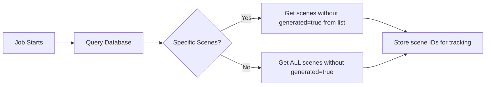
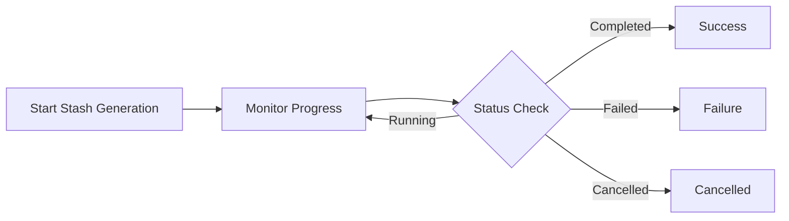
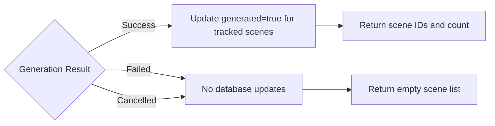

# Stash Generate Metadata Job

## Overview

The **Stash Generate Metadata** job triggers Stash's built-in metadata generation process to create essential media resources for scenes. This job integrates with StashHog's scene attribute tracking system to maintain an accurate record of which scenes have complete resource sets.

## Purpose

This job serves multiple critical functions:
1. **Resource Generation**: Triggers Stash to generate covers, sprites, previews, phashes, and other media resources
2. **Attribute Management**: Automatically tracks and updates the `generated` attribute for scenes
3. **Progress Monitoring**: Provides real-time feedback on generation progress
4. **UI Integration**: Enables viewing of impacted scenes directly from the job monitor

## Key Features

### Intelligent Scene Tracking
- **Pre-execution Tracking**: Before starting generation, the job identifies all scenes that don't have `generated=true`
- **Targeted Updates**: Only updates the `generated` attribute for scenes that actually needed generation
- **All-or-Nothing Updates**: Ensures data integrity by only updating attributes on successful completion

### Comprehensive Resource Generation
The job can generate:
- **Scene Resources**:
  - Covers (thumbnails/screenshots)
  - Sprites (timeline preview images)
  - Previews (video previews)
  - Phashes (perceptual hashes for duplicate detection)
  - WebP format images
  - VTT files (timeline navigation)
  - Interactive heatmaps

- **Marker Resources**:
  - Marker videos
  - Marker screenshots
  - Marker WebP images

### Flexible Configuration
- Can target specific scenes or process all scenes
- Supports custom preview generation settings
- Allows overwriting existing resources
- Configurable transcoding options

## Implementation Details

### File Location
`backend/app/jobs/stash_generate_jobs.py`

### Job Type
`JobType.STASH_GENERATE`

### Database Integration

#### Scene Tracking
Before generation starts:
```python
# Query scenes without generated attribute
SELECT id FROM scene WHERE generated = FALSE
```

After successful completion:
```python
# Update all tracked scenes
UPDATE scene SET generated = TRUE WHERE id IN (tracked_scene_ids)
```

### Return Data Structure
```python
{
    "job_id": "uuid",
    "stash_job_id": "stash-internal-id",
    "status": "completed",
    "scenes_updated_count": 150,
    "scenes_updated": ["scene_id_1", "scene_id_2", ...],
    "start_time": "2025-01-16T10:00:00Z",
    "end_time": "2025-01-16T10:30:00Z"
}
```

## Workflow

### 1. Pre-Generation Phase


### 2. Generation Phase


### 3. Post-Generation Phase


## Configuration Options

### Default Settings
```python
{
    "covers": True,           # Generate scene thumbnails
    "sprites": True,          # Generate timeline sprites
    "previews": True,         # Generate video previews
    "imagePreviews": False,   # Generate image previews
    "markers": True,          # Generate marker resources
    "markerImagePreviews": False,
    "markerScreenshots": True,
    "transcodes": False,      # Transcode videos
    "forceTranscodes": False,
    "phashes": True,          # Generate perceptual hashes
    "interactiveHeatmapsSpeeds": False,
    "clipPreviews": True,
    "imageThumbnails": True,
    "overwrite": False        # Don't overwrite existing
}
```

### Preview Options
```python
{
    "previewSegments": 12,          # Number of preview segments
    "previewSegmentDuration": 0.75, # Duration per segment (seconds)
    "previewExcludeStart": "0",     # Exclude from start (%)
    "previewExcludeEnd": "0",       # Exclude from end (%)
    "previewPreset": "slow"         # Encoding preset
}
```

## Error Handling

### Failure Scenarios
1. **Stash Connection Failure**: Job fails immediately, no database updates
2. **Generation Failure**: Job marked as failed, no scene attributes updated
3. **Partial Failure**: Treated as complete failure (all-or-nothing)
4. **Cancellation**: Job stops cleanly, no scene attributes updated

### Recovery Strategy
- Failed jobs can be retried through the UI
- Scene tracking starts fresh on each execution
- No partial updates ensure data consistency

## UI Integration

### Job Monitor Features
- **Progress Display**: Real-time percentage and status messages
- **Scene Count**: Shows number of scenes being processed
- **View Impacted Scenes**: Button appears for completed jobs with updated scenes
- **Retry Option**: Available for failed jobs
- **Cancel Option**: Available for running jobs

### Scene Filtering
After job completion, users can:
- Click "View Impacted Scenes" to see all updated scenes
- Filter scenes by `generated=true` or `generated=false`
- Verify generation results visually

## Performance Considerations

### Database Queries
- Single query to identify scenes needing updates (indexed on `generated`)
- Batch update for all tracked scenes on completion
- Minimal database overhead

### Memory Management
- Scene IDs stored in memory during execution
- Reasonable limits for large libraries (tested with 10,000+ scenes)

### Network Communication
- Continuous polling of Stash job status
- 2-second intervals to balance responsiveness and load
- Graceful handling of connection issues

## Integration with Other Jobs

### Check Stash Generate Job
- Identifies scenes needing generation
- Sets `generated=false` for incomplete scenes
- Provides input for targeted generation runs

### Process New Scenes Job
- Can trigger generation after importing new content
- Ensures new scenes get necessary resources

### Workflow Jobs
- Can be included in multi-step workflows
- Generation status tracked across workflow steps

## Best Practices

### When to Run
1. **After New Content Import**: Generate resources for newly added scenes
2. **After Stash Scan**: Ensure all discovered content has resources
3. **Scheduled Maintenance**: Regular runs to catch any missing resources
4. **Before Distribution**: Ensure complete resource sets before sharing

### Optimization Tips
1. **Target Specific Scenes**: Use scene IDs for faster, focused generation
2. **Off-Peak Scheduling**: Run during low-usage periods for better performance
3. **Monitor Disk Space**: Generation creates substantial media files
4. **Review Settings**: Adjust preview quality based on needs vs. storage

## Monitoring and Logging

### Log Messages
```
INFO: Starting Stash generate job {job_id}
INFO: Found 150 scenes without generated attribute
INFO: Started Stash job {stash_job_id}
INFO: Updated generated attribute for 150 scenes
```

### Metrics Tracked
- Total scenes processed
- Scenes updated count
- Generation duration
- Success/failure rate

## Migration Notes

### Database Migration Required
Ensure the `generated` column exists on the `scene` table:
```sql
ALTER TABLE scene ADD COLUMN generated BOOLEAN DEFAULT FALSE NOT NULL;
CREATE INDEX idx_scene_generated ON scene(generated);
```

### Backward Compatibility
- Works with existing scenes (defaults to `generated=false`)
- No impact on scenes already marked as `generated=true`
- Can be run multiple times safely (idempotent)

## Troubleshooting

### Common Issues

1. **No scenes updated despite successful generation**
   - Check if scenes already had `generated=true`
   - Verify database connectivity during update phase

2. **Job completes but resources still missing**
   - Run Check Stash Generate job to identify specific missing resources
   - Verify Stash configuration and permissions

3. **Memory issues with large libraries**
   - Consider processing scenes in batches
   - Use scene ID filtering for targeted runs

4. **Slow generation performance**
   - Check Stash server resources (CPU, disk I/O)
   - Adjust preview quality settings
   - Consider parallel processing limits

## API Reference

### Triggering the Job
```python
POST /api/jobs
{
    "type": "stash_generate",
    "parameters": {
        "sceneIDs": ["id1", "id2"],  # Optional: specific scenes
        "covers": true,
        "sprites": true,
        "previews": true,
        "overwrite": false
    }
}
```

### Monitoring Progress
```python
GET /api/jobs/{job_id}
Response: {
    "id": "job_id",
    "type": "stash_generate",
    "status": "running",
    "progress": 45,
    "message": "Generate metadata: Generating previews..."
}
```

### Viewing Results
```python
GET /api/jobs/{job_id}
Response: {
    "id": "job_id",
    "type": "stash_generate", 
    "status": "completed",
    "result": {
        "scenes_updated_count": 150,
        "scenes_updated": ["scene1", "scene2", ...]
    }
}
```

## Future Enhancements

### Planned Features
1. **Incremental Updates**: Update scenes as they complete rather than all-at-once
2. **Priority Queuing**: Process high-priority scenes first
3. **Resource Validation**: Verify generated resources meet quality standards
4. **Selective Generation**: Choose specific resource types per scene

### Under Consideration
1. **Parallel Processing**: Multiple Stash instances for faster generation
2. **Smart Scheduling**: Automatic scheduling based on system load
3. **Quality Profiles**: Different generation settings for different content types
4. **Integration with CDN**: Automatic upload of generated resources

## Related Documentation

- [Scene Attributes Documentation](../scene-attributes.md)
- [Check Stash Generate Job](./check_stash_generate.md)
- [Adding New Jobs Guide](../adding-new-jobs.md)
- [Avoiding Greenlet Errors](../avoiding-greenlet-errors.md)